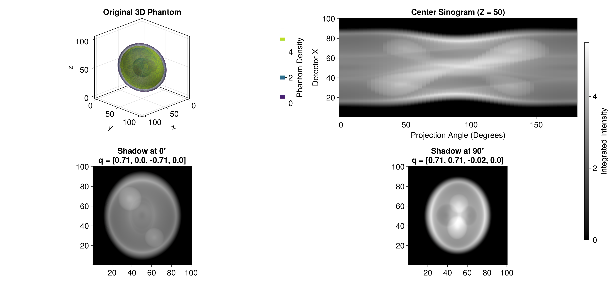

```@meta
CurrentModule = HeteroTomo3D
```

# Mean Estimation
This section covers the estimation of the 3D mean function using the RKHS representer theorem and direct linear solvers.

## Data Structures
```@docs
EvaluationGrid
QuaternionGrid
BlockDiag
LazyKhatri
```

## Representer Theorem Solver
The mean function is estimated by solving the system 
$$ (\mathbf{K} + \lambda \mathbf{I}) \mathbf{a} = \mathbf{y}.$$

```@docs
build_mean_gram!
solve_mean!
```

## 3D Reconstruction
Once the coefficients $\mathbf{a}$ are found, the continuous 3D volume is reconstructed via the evaluation tensor action.

```@docs
reconstruct_mean
```


## Example

This example demonstrates the 3D X-ray transform applied to a 100x100x100 random Shepp-Logan phantom across 60 projection regular angles. To run this example:

1.  Navigate to the `examples/` directory in your terminal.

2.  Launch Julia and activate the local environment:

    ```sh
    julia --project=.
    ```
3.  From the Julia REPL, run the script:

    ```julia
    include("test_fwd.jl")
    ```

This will generate the interactive 3D visualization and save the output image `forward_simulation.png` to your assets folder.
Here is the final layout showing the true 3D phantom density contours, the center sinogram, and the 2D integrated intensity shadows at 0° and 90°.

