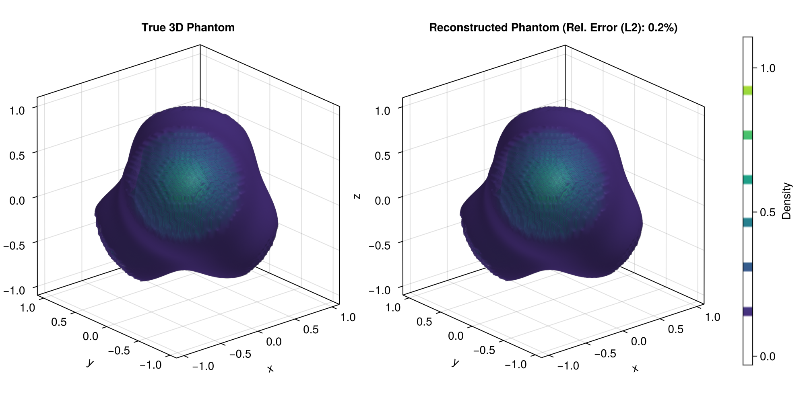

```@meta
CurrentModule = HeteroTomo3D
```

# Mean Estimation
This tutorial demonstrates how to **estimate the 3D mean function** from tomographic projections using the **RKHS representer theorem** and **iterative Krylov subspace solvers**. 

To maintain a clear focus on the solver mechanics, this example uses a **deterministic inverse problem framework** that excludes measurement noise and functional randomness.

## Data Generation

### Setup Global Parameters
```julia
n = 1       # Single Deterministic Function
r = 50      # Number of quaternions
s = 100      # Number of evaluation points per viewing angles
m = 50      # Resolution for reconstruction
L = 4       # Number of Gaussian components in the phantom
γ = 10.0    # Kernel bandwidth for RKHS framework
```

### 3D Phantom and X-ray Transform
```julia
using HeteroTomo3D, BlockArrays, LinearAlgebra

centers = [
    (0.3, 0.3, 0.3),
    (-0.3, -0.3, 0.3),
    (-0.4, 0.4, -0.4),
    (0.3, -0.3, -0.3)
]
weights = reshape([1.0, 0.8, 0.6, 0.4], L, n)
gammas = [5.0, 4.0, 6.0, 4.0]

phantom = KernelPhantom3D(weights, centers, gammas)

# Generate the forward setup
X = rand_evaluation_grid(s, r, n, m)    # Evaluation grid for the forward operator
Q = rand_quaternion_grid(r, n)          # Random quaternion grid for the forward operator
projections = xray_transform(phantom, X, Q) # Size: (s, r, n)
y = vec(projections) # Flatten the projections to a vector for the linear system
```


## Representer Theorem Solver via MINRES
The mean function is estimated by solving the system 
```math
(\mathbf{K} + \lambda \mathbf{I}) \mathbf{a} = \mathbf{y}.
```

```julia
block_sizes = repeat([s * r], n);
K = BlockMatrix{Float64}(undef, block_sizes, block_sizes);
build_gram_matrix!(K, X, Q, γ);

using Krylov

a_zero = zeros(size(K, 1)) # Create a zero initial guess for MINRES
kc_mean = KrylovConstructor(a_zero)
workspace_mean = MinresWorkspace(kc_mean)
minres!(workspace_mean, K, y; history=true, itmax=20)

a_sol = Krylov.solution(workspace_mean)
stats_mean = Krylov.statistics(workspace_mean)
```

## 3D Reconstruction
Once the representer coefficients ``\mathbf{a}`` are computed, the estimated continuous 3D function can be evaluated over a regular voxel grid to form the final volume.

```@docs
xray_recons
xray_recons!
```

The resulting reconstructed volume can then be visualized alongside the ground-truth 3D phantom using `GLMakie.jl`.
```julia
using GLMakie

F = Array{Float64}(undef, m, m, m);
xray_recons!(F, a_sol, X, Q, γ);

F_true = zeros(Float64, m, m, m);
for iz in 1:m
    z3 = 2.0 * (iz - 1) / (m - 1) - 1.0
    for iy in 1:m
        z2 = 2.0 * (iy - 1) / (m - 1) - 1.0
        for ix in 1:m
            z1 = 2.0 * (ix - 1) / (m - 1) - 1.0

            # Unit ball cutoff matching the reconstruction
            if z1^2 + z2^2 + z3^2 > 1.0
                continue
            end

            val = 0.0
            for l in 1:L
                c = phantom.centers[l]
                dist2 = (z1 - c[1])^2 + (z2 - c[2])^2 + (z3 - c[3])^2
                val += phantom.weights[l, 1] * exp(-phantom.gammas[l] * dist2)
            end
            F_true[ix, iy, iz] = val
        end
    end
end

# Compute the L2 relative error strictly in-place
squared_diff = sum(abs2(F[i] - F_true[i]) for i in eachindex(F))
squared_norm = sum(abs2, F_true)

rel_error = sqrt(squared_diff / squared_norm)

# 2. Plot Side-by-Side Volumes using Isosurfaces
fig = Figure(size=(1000, 500))
bounds = (-1.0, 1.0)

ax1 = Axis3(fig[1, 1], title="True 3D Phantom", aspect=:data)

vol1 = contour!(ax1, bounds, bounds, bounds, F_true,
    levels=6,
    colormap=:viridis,
    alpha=0.4)

ax2 = Axis3(fig[1, 2], title="Reconstructed Phantom (Rel. Error (L2): $(round(rel_error * 100, digits=2))%)", aspect=:data)
vol2 = contour!(ax2, bounds, bounds, bounds, F,
    levels=6,
    colormap=:viridis,
    alpha=0.4)

Colorbar(fig[1, 3], vol2, label="Density")

display(fig)
```

Executing this code will open an interactive 3D window allowing you to explore the reconstructed density contours. For the complete, runnable script, please refer to `examples/test_mean_reconstruction.jl` in the package repository.


