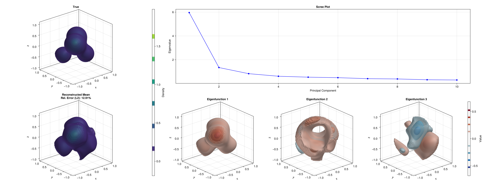

```@meta
CurrentModule = HeteroTomo3D
```

# Noisy 3D Reconstruction
As a final tutorial, we demonstrate how to **estimate the covariance oprator of random 3D function**, under measurement noise and functional randomness.

## Data Generation

### Setup Global Parameters
Due to computational complexity, we fix ``\gamma=6`` from the previous tutorial.
```julia
n = 30       # Single Deterministic Function
r = 5      # Number of quaternions
s = 20      # Number of evaluation points per viewing angles
m = 50      # Resolution for reconstruction
L = 4       # Number of Gaussian components in the phantom
λ = 0.2    # Covariance level for weights
σ = 0.01   # Noise level
gamma_val = 6.0    # Kernel bandwidth for RKHS framework
```

### 3D Phantom and X-ray Transform
```julia
using HeteroTomo3D, BlockArrays, LinearAlgebra

centers = [
    (0.3, 0.3, 0.3),
    (-0.3, -0.3, 0.3),
    (-0.4, 0.4, -0.4),
    (0.3, -0.3, -0.3)
]
gammas = [5.0, 4.0, 6.0, 4.0] .* 2

# Draw random weights
mean_vec = [1.0, 0.8, 0.6, 0.4] .* 2
cov_matrix = λ * I(L) # Isotropic covariance for simplicity
Random.seed!(42)
weights = rand(MvNormal(mean_vec, cov_matrix), n) # Size: (L, n)

phantom = KernelPhantom3D(weights, centers, gammas)

# Generate the forward setup
X = rand_evaluation_grid(s, r, n, m; seed=123)    # Evaluation grid for the forward operator
Q = rand_quaternion_grid(r, n; seed=123)          # Random quaternion grid for the forward operator
projections = xray_transform(phantom, X, Q) # Size: (s, r, n)

# Add noise to the projections
Random.seed!(456)
noise = σ * randn(size(projections))
noisy_projections = projections + noise
y = vec(noisy_projections); # Flatten the projections to a vector for the linear system
```


## Representer Theorem Solver via MINRES
We solve the representer theorem for covariance estimation.
```math
(\mathbf{K} \odot \mathbf{K} + \lambda \mathbf{I}) \mathbf{A} = \mathbf{y} \odot \mathbf{y}.
```

```julia
block_sizes = repeat([s * r], n);
K = BlockMatrix{Float64}(undef, block_sizes, block_sizes);
build_gram_matrix!(K, X, Q, γ);

y_centered = y
y_block = BlockVector(y_centered, block_sizes)
Y = y_block ⊙ y_block

using Krylov

K_tens = CovFwdTensor(K)
Y_zero = zero_block_diag(block_sizes)
kc_cov = KrylovConstructor(Y_zero)
workspace_cov = MinresWorkspace(kc_cov)


println("Processing Covariance Estimation for γ = $gamma_val")
# MINRES solver
@time minres!(workspace_cov, K_tens, Y; history=true, itmax=20)
A_sol = Krylov.solution(workspace_cov)
```

## Perform Functional PCA
Once the representer coefficients ``\mathbf{A}`` are computed, We then perform fPCA to extract the representing coefficients of leading eigenfunctions and reconstruct their corresponding 3D functions.

```julia
println("Performing Functional PCA")
Λ, V = fpca(10, A_sol, K; itmax=100)

F_eigs = [Array{Float64}(undef, m, m, m) for _ in 1:3]
for k in 1:3
    println("Reconstructing Eigenfunction $k")
    @time xray_recons!(F_eigs[k], V[:, k], X, Q, gamma_val)
end
```

## 3D Reconstruction
Once the representer coefficients ``\mathbf{a}`` are computed, the estimated continuous 3D function can be evaluated over a regular voxel grid to form the final volume.

The resulting reconstructed volume can then be visualized alongside the ground-truth 3D phantom using `GLMakie.jl`.
```julia
using GLMakie

fig = Figure(size=(2400, 1000))
bounds = (-1.0, 1.0)

gl_top = fig[1:2, 1] = GridLayout()
gl_scree = fig[1, 2:3] = GridLayout()
gl_bot = fig[2, 2:3] = GridLayout()

# Top row
ax1 = Axis3(gl_top[1, 1], title="True", aspect=:data)
# alpha=0.4 to see inside.
vol1 = contour!(ax1, bounds, bounds, bounds, F_true,
    levels=6,
    colormap=:viridis,
    alpha=0.4)

ax_mean = Axis3(gl_top[2, 1], title="Reconstructed Mean\nRel. Error (L2): $(round(rel_error * 100, digits=2))%", aspect=:data)
vol_mean = contour!(ax_mean, bounds, bounds, bounds, F_recon, levels=6, colormap=:viridis, alpha=0.4)
Colorbar(gl_top[1:2, 2], vol_mean, label="Density")

ax_scree = Axis(gl_scree[1, 1], title="Scree Plot", xlabel="Principal Component", ylabel="Eigenvalue")
scatterlines!(ax_scree, 1:10, Λ, color=:blue, markersize=10)

# Bottom row (Eigenfunctions)
global_max_val = maximum(maximum(abs, F) for F in F_eigs)
global_max_val = global_max_val == 0 ? 1.0 : global_max_val

# Avoid zero level to prevent a massive block covering the whole volume
eig_levels = [-0.8, -0.6, -0.4, -0.2, 0.2, 0.4, 0.6, 0.8] .* global_max_val

vol_eig = nothing
for k in 1:3
    ax_eig = Axis3(gl_bot[1, k], title="Eigenfunction $k", aspect=:data)
    F_eig = F_eigs[k]
    vol_eig = contour!(ax_eig, bounds, bounds, bounds, F_eig, levels=eig_levels, colormap=:balance, colorrange=(-global_max_val, global_max_val), alpha=0.3)
end
Colorbar(gl_bot[1, 4], vol_eig, label="Value")

display(fig)

save_path = joinpath("..", "docs", "src", "assets", "cov_fpca_results.png")
save(save_path, fig)
```

Executing this code will open an interactive 3D window allowing you to explore the reconstructed density contours. For the complete, runnable script, please refer to `examples/test_cov.jl` in the package repository.

