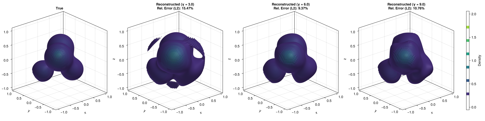

```@meta
CurrentModule = HeteroTomo3D
```

# Noisy 3D Reconstruction
Continuing to previous tutorials, this tutorial demonstrates how to **estimate the 3D function**, but now with measurement noise and functional randomness.

## Data Generation

### Setup Global Parameters
```julia
n = 100     # Number of sample paths (functions)
r = 5       # Number of quaternions
s = 20      # Number of evaluation points per viewing angles
m = 50      # Resolution for reconstruction
L = 4       # Number of Gaussian components in the phantom
λ = 0.2     # Covariance level for weights
σ = 0.01    # Noise level
gamma_list = [3.0, 6.0, 9.0]    # Kernel bandwidths for RKHS framework
```

### 3D Phantom and X-ray Transform
```julia
using HeteroTomo3D, BlockArrays, LinearAlgebra

centers = [
    (0.3, 0.3, 0.3),
    (-0.3, -0.3, 0.3),
    (-0.4, 0.4, -0.4),
    (0.3, -0.3, -0.3)
]
gammas = [5.0, 4.0, 6.0, 4.0] .* 2

# Draw random weights
mean_vec = [1.0, 0.8, 0.6, 0.4] .* 2
cov_matrix = λ * I(L) # Isotropic covariance for simplicity
Random.seed!(42)
weights = rand(MvNormal(mean_vec, cov_matrix), n) # Size: (L, n)

phantom = KernelPhantom3D(weights, centers, gammas)

# Evaluate dense 3D phantom
function evaluate_phantom(w_vec, centers, gammas, m)
    F = zeros(Float64, m, m, m)
    for iz in 1:m, iy in 1:m, ix in 1:m
        z1 = 2.0 * (ix - 1) / (m - 1) - 1.0
        z2 = 2.0 * (iy - 1) / (m - 1) - 1.0
        z3 = 2.0 * (iz - 1) / (m - 1) - 1.0
        if z1^2 + z2^2 + z3^2 <= 1.0
            val = 0.0
            for l in eachindex(centers)
                c = centers[l]
                dist2 = (z1 - c[1])^2 + (z2 - c[2])^2 + (z3 - c[3])^2
                val += w_vec[l] * exp(-gammas[l] * dist2)
            end
            F[ix, iy, iz] = val
        end
    end
    return F
end

# Evaluate all 3D volumes
F_true = evaluate_phantom(mean_vec, centers, gammas, m);
squared_norm = sum(abs2, F_true)

# Generate the forward setup
X = rand_evaluation_grid(s, r, n, m; seed=123)    # Evaluation grid
Q = rand_quaternion_grid(r, n; seed=123)          # Random quaternion grid
projections = xray_transform(phantom, X, Q) # Size: (s, r, n)


# Add noise to the projections
Random.seed!(456)
noise = σ * randn(size(projections))
noisy_projections = projections + noise
y = vec(projections) # Flatten the projections to a vector for the linear system
```


## Representer Theorem Solver via MINRES
We solve the representer theorem for multiple values of the kernel bandwidth ``\gamma`` to see its regularizing effect, and compare the reconstruction against the ground truth expected function.
```math
(\mathbf{K} + \lambda \mathbf{I}) \mathbf{a} = \mathbf{y}.
```

```julia
block_sizes = repeat([s * r], n);
K = BlockMatrix{Float64}(undef, block_sizes, block_sizes);

a_zero = zeros(size(K, 1)) # Create a zero initial guess for MINRES
kc_mean = KrylovConstructor(a_zero)
workspace_mean = MinresWorkspace(kc_mean)

F_recons = [Array{Float64}(undef, m, m, m) for _ in 1:length(gamma_list)]
rel_errors = zeros(length(gamma_list))

for (idx, γ_val) in enumerate(gamma_list)
    println("Processing γ = $γ_val")
    @time build_gram_matrix!(K, X, Q, γ_val)

    fill!(workspace_mean.x, 0.0) # Ensure zero start across iterations
    @time minres!(workspace_mean, K, y; history=true, itmax=20)
    a_sol = Krylov.solution(workspace_mean)

    @time xray_recons!(F_recons[idx], a_sol, X, Q, γ_val)  # Computationally most expensive part

    # Compute the L2 relative error strictly in-place
    squared_diff = sum(abs2(F_recons[idx][i] - F_true[i]) for i in eachindex(F_recons[idx]))
    rel_errors[idx] = sqrt(squared_diff / squared_norm)
end
```

## 3D Reconstruction
Once the representer coefficients ``\mathbf{a}`` are computed, the estimated continuous 3D function can be evaluated over a regular voxel grid to form the final volume.


The resulting reconstructed volume can then be visualized alongside the ground-truth 3D phantom using `GLMakie.jl`.
```julia
using GLMakie

fig = Figure(size=(2000, 500))
bounds = (-1.0, 1.0)

ax1 = Axis3(fig[1, 1], title="True", aspect=:data)
# alpha=0.4 to see inside.
vol1 = contour!(ax1, bounds, bounds, bounds, F_true,
    levels=6,
    colormap=:viridis,
    alpha=0.4)

for (idx, γ_val) in enumerate(gamma_list)
    ax_recon = Axis3(fig[1, idx+1], title="Reconstructed (γ = $γ_val)\nRel. Error (L2): $(round(rel_errors[idx] * 100, digits=2))%", aspect=:data)
    contour!(ax_recon, bounds, bounds, bounds, F_recons[idx],
        levels=6,
        colormap=:viridis,
        alpha=0.4)
end

Colorbar(fig[1, 5], vol1, label="Density")

display(fig)


save_path = joinpath("..", "docs", "src", "assets", "mean_noisy_recons_gammas.png")
save(save_path, fig)
```

Executing this code will open an interactive 3D window allowing you to explore the reconstructed density contours. For the complete, runnable script, we recommend to run `examples/test_mean_noisy.jl` in the package repository.

